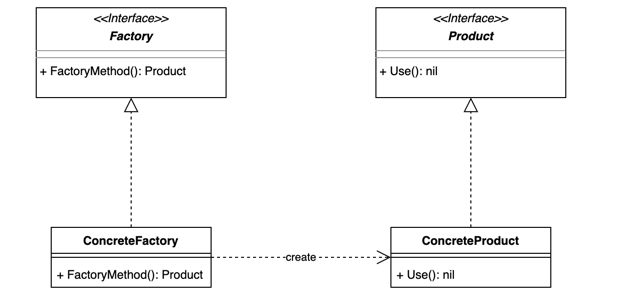

## 工厂方法模式

用于实现不同的工厂生产不同的物品

### 优缺点分析
1. 优点
    - 1.1 一个调用者想创建一个对象，只要知道其名称就可以了。
    - 1.2 扩展性高，如果想增加一个产品，只要扩展一个工厂类就可以。
    - 1.3 屏蔽产品的具体实现，调用者只关心产品的接口。
2. 缺点
    - 2.1 每次增加一个产品时，都需要增加一个具体类和对象实现工厂，使得系统中类的个数成倍增加，增加了系统的复杂度。
    - 2.2 抽象工厂模式中，抽象工厂类可以创建多个产品，这是工厂方法模式所不能做到的。